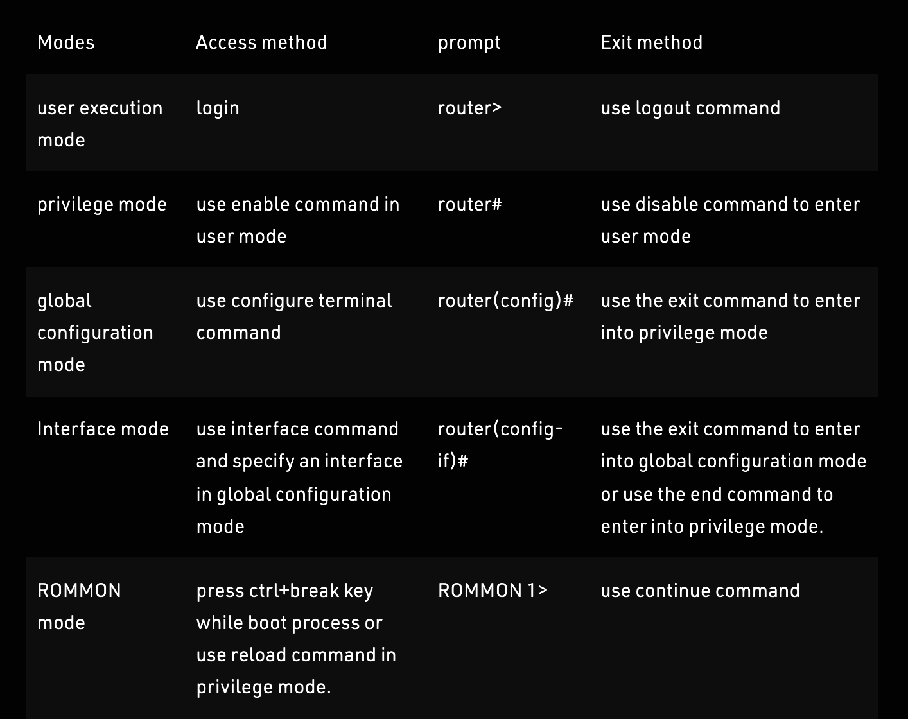

# Dit bestand bevat een enumeratie van de alle cli commando's

    ```
    enable
    configure terminal
    ```
    
    meestal start je in "user execution mode" mode en will ja naar 
    "privilege mode" gaan. het "enable" commando laat exact dat toe. 
    Het laat toe te switchen van user execution mode naar privilege mode
    
